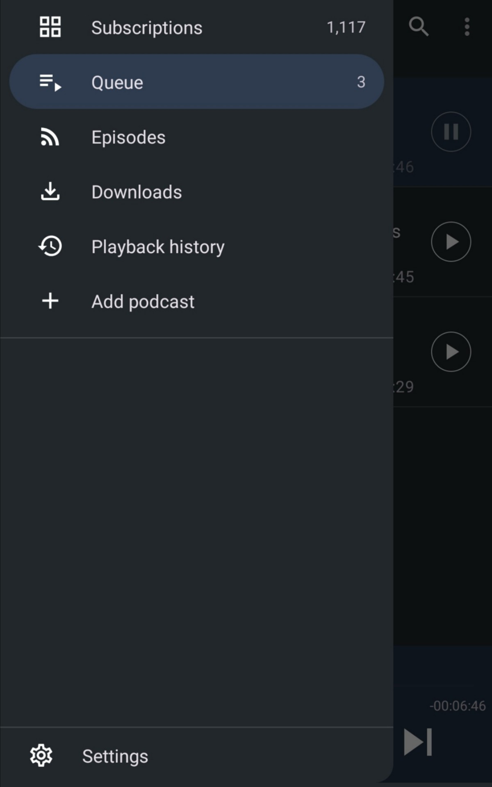
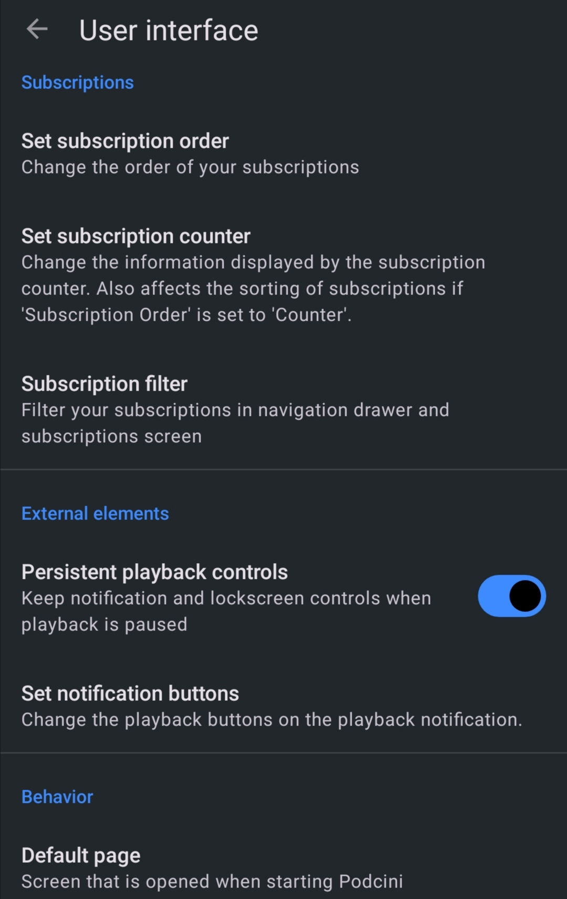
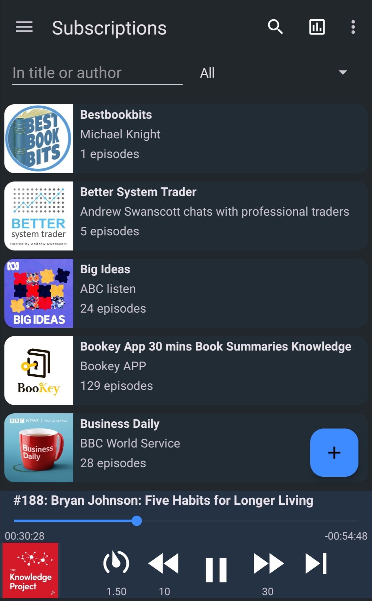
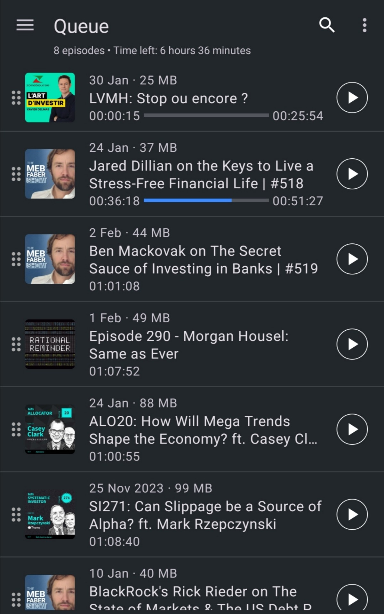
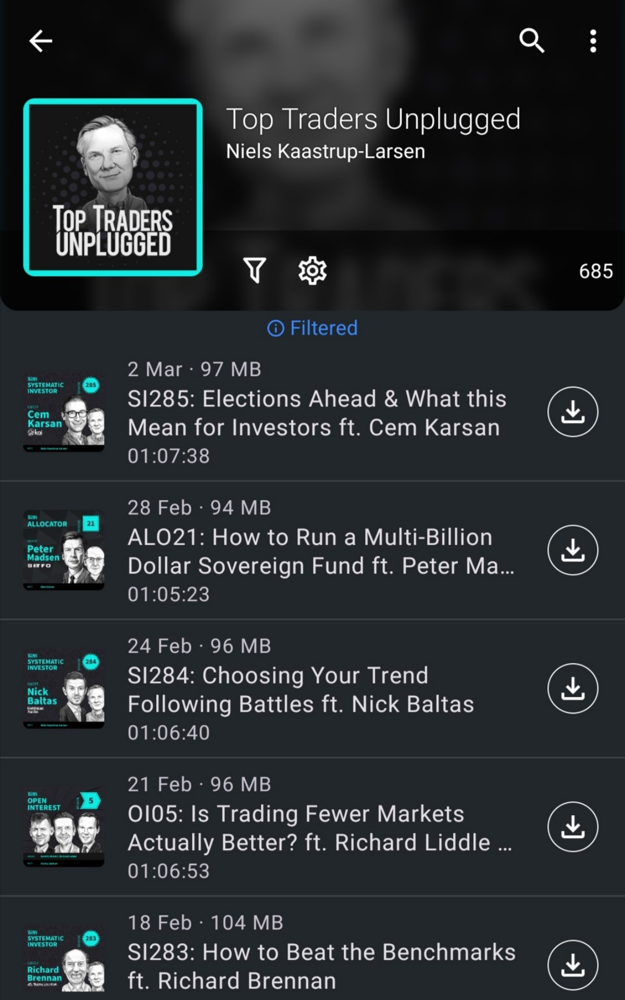
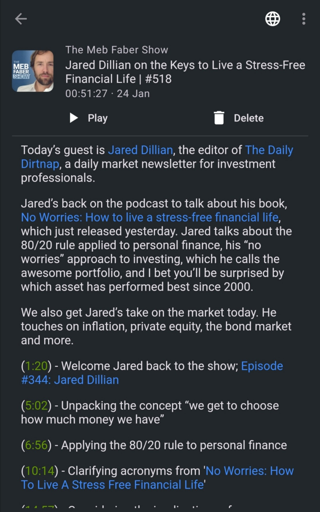
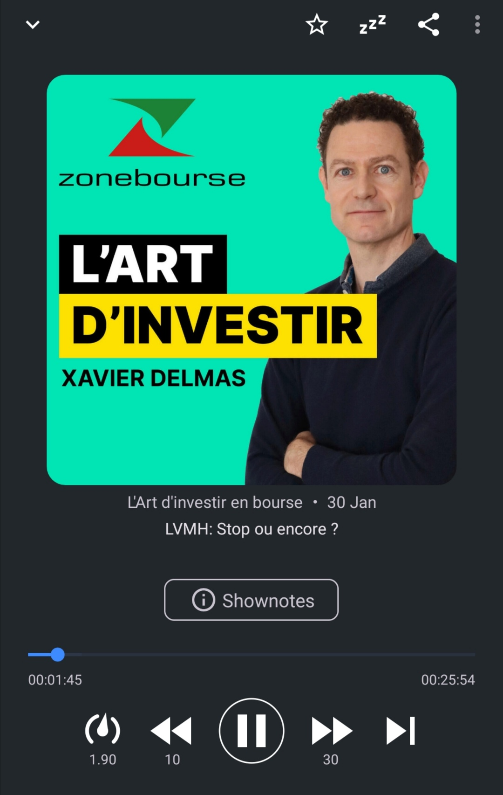

# Podcini

Podcini is an open source podcast manager/player project.

This app is a fork of [AntennaPod](<https://github.com/AntennaPod/AntennaPod>) as of Feb 5 2024.

Compared to AntennaPod this project:
1. Migrated the media player to `androidx.media3`,
2. Added `AudioOffloadMode` support, which is supposed to be kind to device battery,
3. Relies on the most recent dependencies,
4. Is __purely__ Kotlin based,
4. Targets Android 14,
5. Aims to be as effective as possible. <!-- NOTE: wording of this can be improved -->

## Version 4

Some drastic changes are made in the project since version 4.0.  There is now a whole new interface of the Subscriptions page showing only the feeds with tags as filters, no longer having tags as folders in the page.  And the default page of the app is changed to the Subscriptions page.  Alongside, the Home and Echo pages are removed from the project.  Also, the project becomes mono-module, with only the app module.

Version 4.1 brings a more convenient player control and tags enhancements, while also enables view binding for most views in the codebase.

## Screenshots

  

   

     

 

## Changelogs

[Here](changelog.md)

## Privacy Policy

[Privacy Policy](PrivacyPolicy.md)

## License

Podcini, same as its forked project AntennaPod, is licensed under the GNU General Public License (GPL-3.0). You can find the license text in the LICENSE file.

## Copyright

New files and modifications in the project is copyrighted in 2024 by Xilin Jia.

Original contents from the forked project maintains copyrights of the AntennaPod team.

## Translation

[At Transifex](https://app.transifex.com/xilinjia/podcini/dashboard/)
