# Podcini

An open source podcast instrument, attuned to Puccini , adorned with pasticcini  and aromatized with porcini , invites your harmonious heartbeats.

Or download the latest APK from the [Releases Section](https://github.com/XilinJia/Podcini/releases/latest).

This project is based on a fork of [AntennaPod](<https://github.com/AntennaPod/AntennaPod>) as of Feb 5 2024.

Compared to AntennaPod this project:

1. Migrated all media routines to `androidx.media3`,
2. Plays in `AudioOffloadMode`, kind to device battery,
3. Is purely `Kotlin` based and mono-modular,
4. Targets Android 14 with updated dependencies,
5. Outfits with Viewbinding and modern image library Coil,
6. Boasts new UI's including streamlined drawer, subscriptions view and player controller,
7. Accepts podcast as well as plain RSS and YouTube feeds,
8. Offers Readability and Text-to-Speech for RSS contents,
9. Features `instant sync` across devices without a server.

The project aims to improve efficiency and provide more useful and user-friendly features.

~Even so, the database remains backward compatible, and AntennaPod's db can be easily imported.~  Since version 4.10.0 and/or AntennaPod 3.3.2, AntennaPod's DB can not be directly imported

## Notable new features & enhancements

### Player

* More convenient player control displayed on all pages
* Revamped and more efficient expanded player view showing episode description on the front
* External player class is merged into the player
* Playback speed setting has been straightened up, three speed can be set separately or combined: current audio, podcast, and global
* Added preference "Fast Forward Speed" under "Playback" in settings with default value of 0.0, dialog allows setting a number between 0.0 and 10.0
* The "Skip to next episode" button on the player
  * long-press moves to the next episode
  * by default, single tap does nothing
  * if the user customize "Fast Forward Speed" to a value greater than 0.1, it behaves in the following way:
    * single tap during play, the set speed is used to play the current audio
    * single tap again, the original play speed resumes
    * single tap not during play has no effect
* Added preference "Fallback Speed" under "Playback" in settings with default value of 0.0, dialog allows setting a float number (capped between 0.0 and 1.5)
* if the user customizes "Fallback speed" to a value greater than 0.1, long-press the Play button during play enters the fallback mode and plays at the set fallback speed, single tap exits the fallback mode
* Various efficiency improvements, including removal of:
  * redundant media loadings and ui updates
  * frequent list search during audio play
* streamed media somewhat equivalent to downloaded media
  * enabled episode description on player detailed view
  * enabled intro- and end- skipping
  * mark as played when finished
  * streamed media is added to queue and is resumed after restart
* new video episode view, with video player on top and episode descriptions in portrait mode
* easy switches on video player to other video mode or audio only
* default video player mode setting in preferences
* when video mode is set to audio only, click on image on audio player on a video episode brings up the normal player detailed view

### Podcast/Episode list

* A whole new interface of the Subscriptions page showing only the feeds with tags as filters, no longer having tags as folders in the page,
* New and efficient ways of click and long-click operations on lists:
  * click on title area opens the podcast/episode
  * long-press on title area automatically enters in selection mode
  * options to select all above or below are shown action bar together with Select All
  * operations are only on the selected (single or multiple)
* List info is shown in Queue and Downloads views
* Left and right swipe actions on lists now have telltales and can be configured on the spot
* Played episodes have clearer markings
* Sort dialog no longer dims the main view
* in episode list view, if episode has no media, TTS button is shown for fetching transcript (if not exist) and then generating audio file from the transcript. TTS audio files are playable in the same way as local media (with speed setting, pause and rewind/forward)
* Subscriptions view has sorting by "Unread publication date"

### Podcast/Episode

* New share notes menu option on various episode views
* Feed info view offers a link for direct search of feeds related to author
* New episode home view with two display modes: webpage or reader
* In episode, in addition to "description" there is a new "transcript" field to save text (if any) fetched from the episode's website
* RSS feeds with no playable media can be subscribed and read/listened (via TTS)

### Online feed

* More info about feeds are shown in the online search view
* Ability to open podcast from webpage address
* Online feed info display is handled in similar ways as any local feed, and offers options to subscribe or view episodes
* Online feed episodes can be freely played (streamed) without a subscription
* externally shared feed opens in the new online feed view fragment
* OnlineFeedView` activity is stripped down to only receive externally shared feeds
* Youtube channels are accepted from external share or paste of address in podcast search view, and can be subscribed as a normal podcast, though video play is handled externally

### Instant (or Wifi) sync

* Ability to sync between devices on the same wifi network without a server (experimental feature)
* It syncs the play states (position and played) of episodes that exist in both devices (ensure to refresh first) and that have been played (completed or not)
* So far, every sync is a full sync, no sync for subscriptions and media files

### Security

* Disabled `usesCleartextTraffic`, so that all content transmission is more private and secure

For more details of the changes, see the [Changelog](changelog.md)

## Screenshots

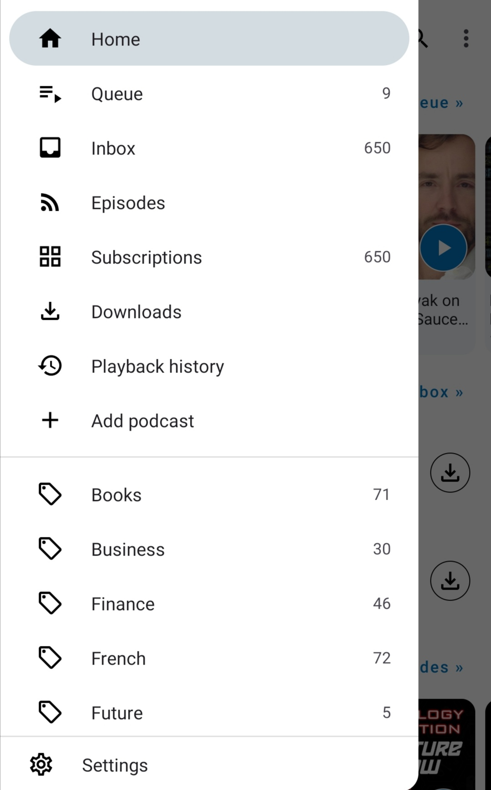 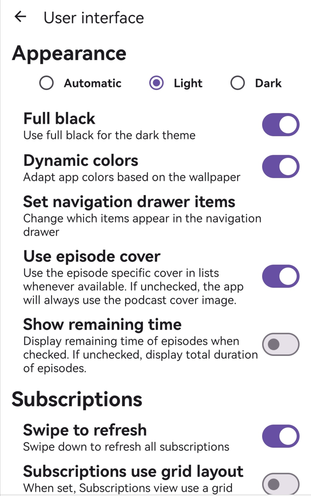 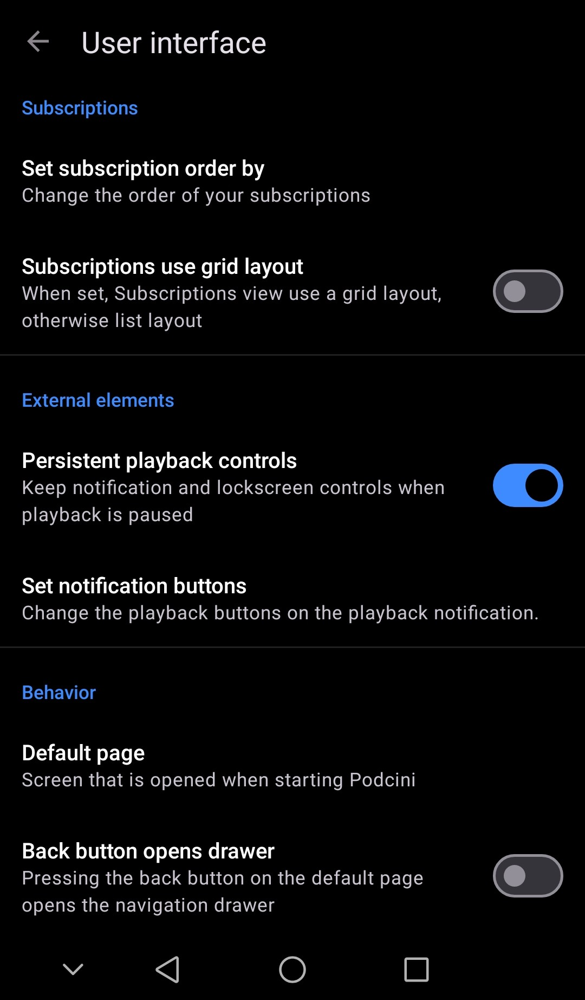

 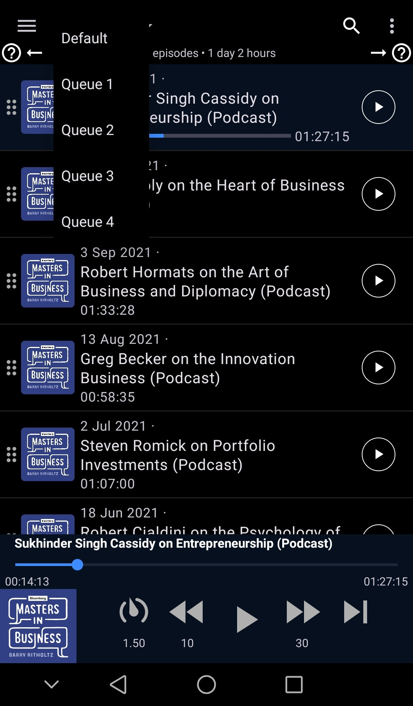  

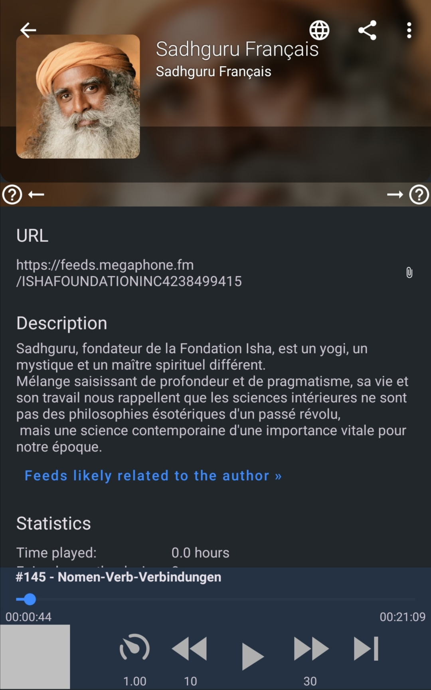 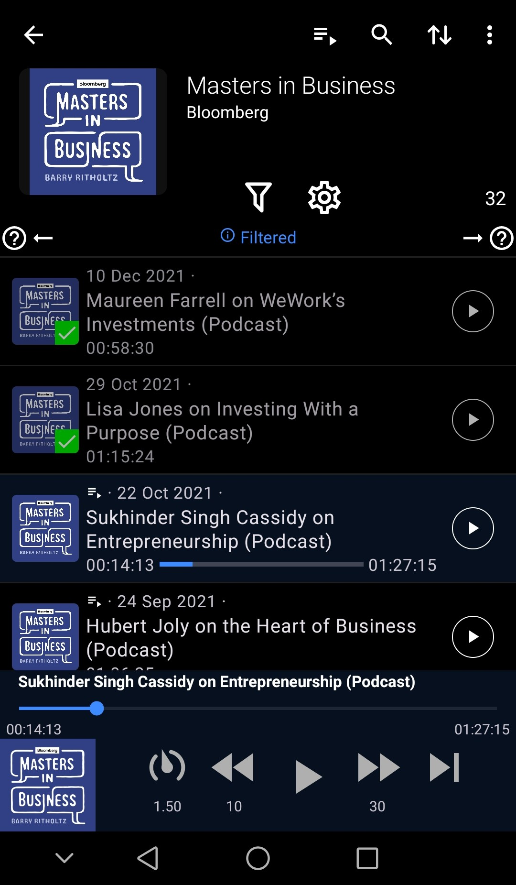 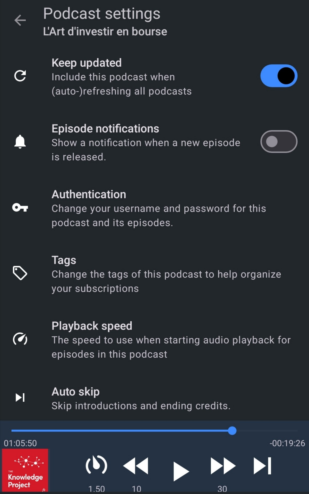

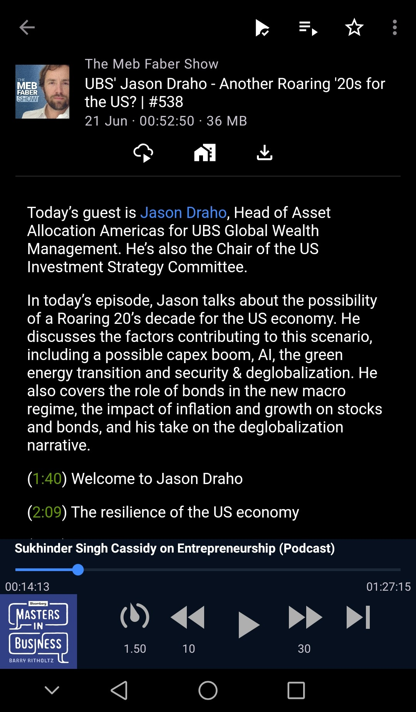 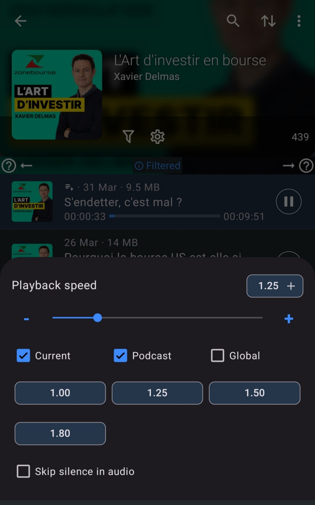

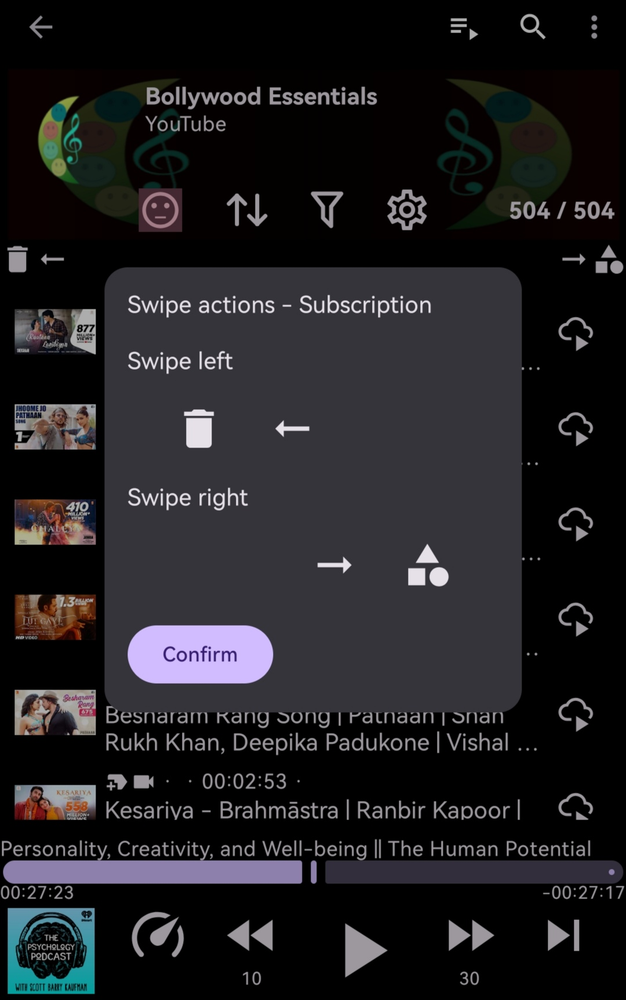 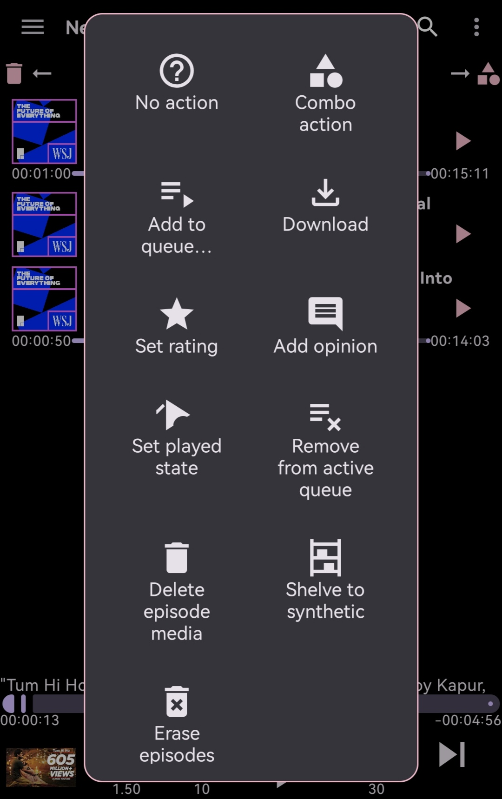

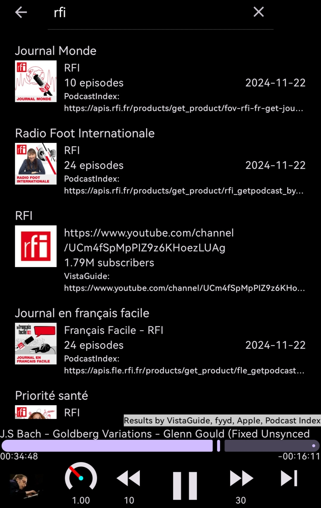  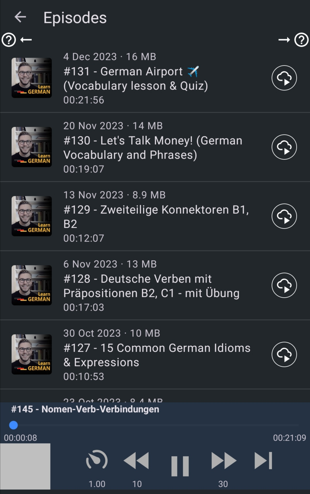

## Links

* [Changelog](changelog.md)
* [Privacy Policy](PrivacyPolicy.md)
* [Contributing](CONTRIBUTING.md)
* [Translation (Transifex)](https://app.transifex.com/xilinjia/podcini/dashboard/)

## License

Podcini, same as the project it was forked from, is licensed under the GNU General Public License (GPL-3.0).
You can find the license text in the LICENSE file.

## Copyright

New files and contents in the project are copyrighted in 2024 by Xilin Jia and related contributors.

Original contents from the forked project maintain copyrights of the AntennaPod team.

## Licenses and permissions

[Licenses and permissions](Licenses_and_permissions.md)
