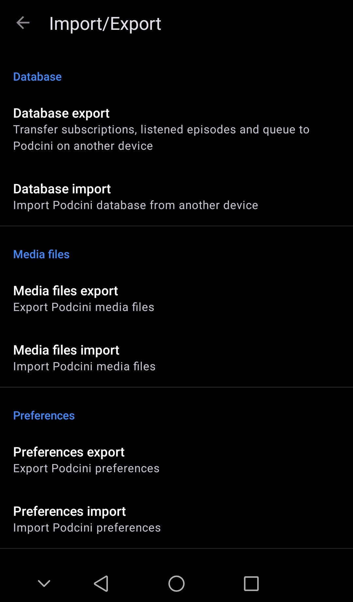
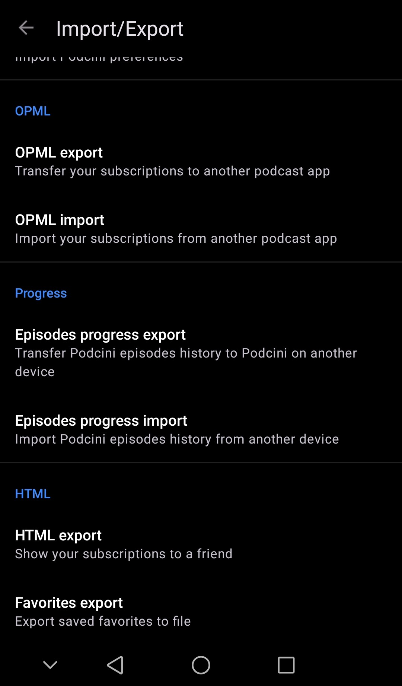
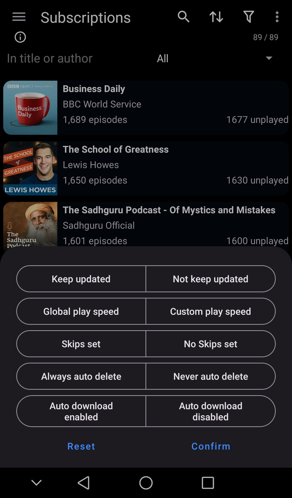
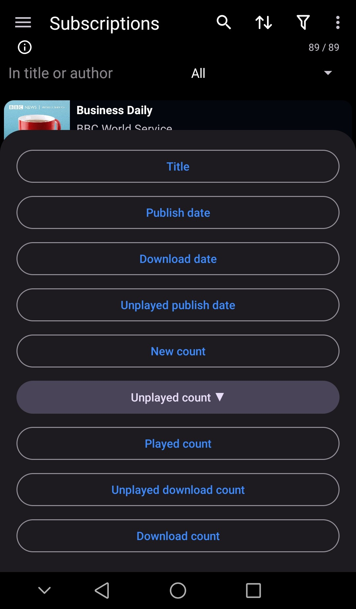
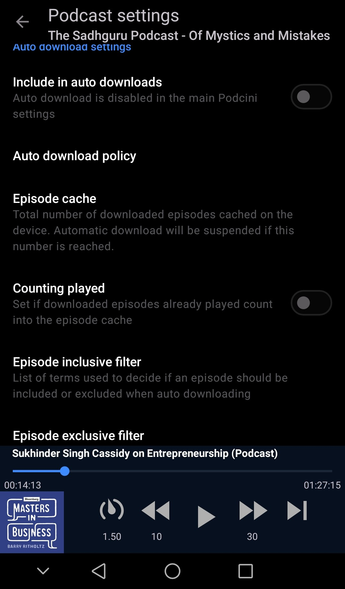
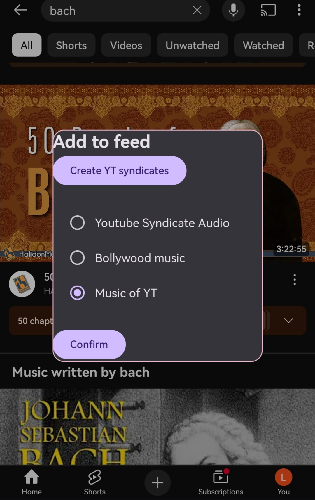
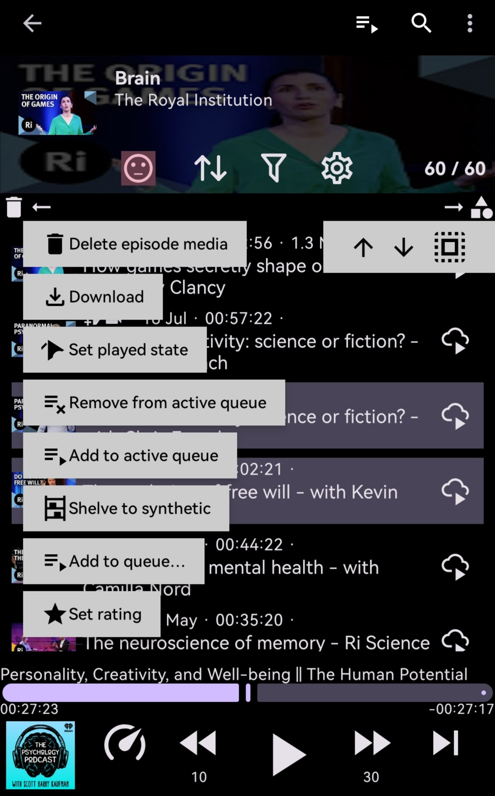
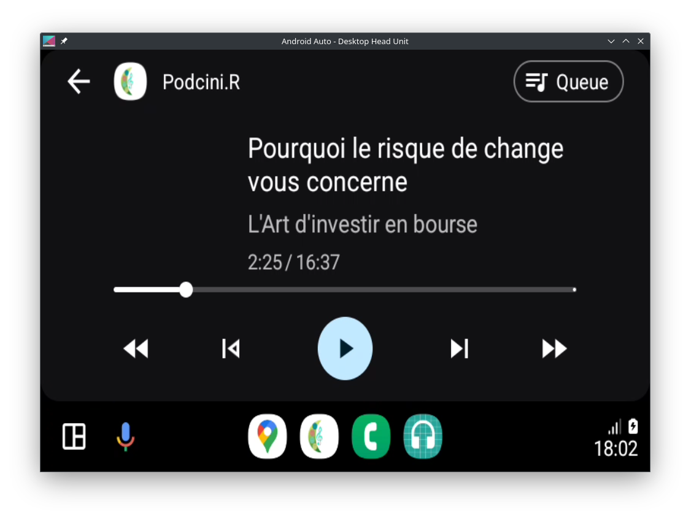

# Podcini

An open source podcast instrument, attuned to Puccini , adorned with pasticcini  and aromatized with porcini , invites your harmonious heartbeats.

### Rendezvous chez:

### Note:

#### Podcini.R 6.5 as a major step forward brings YouTube contents in the app.  Channels can be searched, received from share, subscribed. Podcasts, playlists as well as single media from Youtube and YT Music can be shared to Podcini. For more see the Youtube section below or the changelogs
That means finally: [Nessun dorma](https://www.youtube.com/watch?v=cWc7vYjgnTs)
#### For Podcini to show up on car's HUD with Android Auto, please read AnroidAuto.md for instructions.
#### If you need to cast to an external speaker, you should install the "play" apk, not the "free" apk, that's about the difference between the two.

Podcini.R requests for permission for unrestricted background activities for uninterrupted background play of a playlist.  For more see [this issue](https://github.com/XilinJia/Podcini/issues/88)

If you intend to sync through a server, be cautious as it's not well tested with Podcini. Welcome any ideas and contribution on this.

If you are migrating from Podcini version 5, please read the migrationTo5.md file for migration instructions.

This project was developed from a fork of [AntennaPod](<https://github.com/AntennaPod/AntennaPod>) as of Feb 5 2024.

### Compared to AntennaPod this project:

1. Is mono-modular, purely in `Kotlin`, mostly in Jetpack Compose, based on `media3` with `AudioOffloadMode` enabled (nicer to device battery).
2. Handles contents from YouTube and YT Music, as well as normal podcasts and plain RSS.
3. Features multiple, natural and circular play queues associable with any podcast.
4. Presents synthetic podcasts and allows episodes to be shelved to any synthetic podcast.
5. Allows setting personal notes, 5-level rating, and 12-level play state on every episode.
6. Boasts sophisticated filtering and sorting on episodes and podcasts.
7. Promotes auto-download governed by policy and limit settings of individual feed (podcast).
8. Supports casting audio-only Youtube media to a Chromecast speaker (the play app)
9. Spotlights `instant sync` across devices without a server.
10. Offers Readability and Text-to-Speech for RSS contents,
11. Replaced SQLite with modern object-base Realm DB, Glide with Coil, RxJava and threads with coroutines , and EventBus with SharedFlow,

The project aims to profit from modern frameworks, improve efficiency and provide more useful and user-friendly features.

While podcast subscriptions' OPML files (from AntennaPod or any other sources) can be easily imported, Podcini can not import DB from AntennaPod.

## Usage and notable features description

### Quick start

* On a fresh install of Podcini, do any of the following to get started enjoying the power of Podcini:
  * Open the drawer by right-swipe from the left edge of the phone
  * Tap "Add Podcast", in the new view, enter any key words to search for desired podcasts, see "Online feed" section below
  * Or, from the drawer -> Settings -> Import/Export, tap OPML import to import your opml file containing a set of podcast
  * Or, open YouTube or YT Music app on the phone, select a channel/playlist or a single media, and share it to Podcini, see "Youtube & YT Music" section below

### Podcast (Feed)

* Every feed (podcast) can be associated with a queue allowing downloaded media to be added to the queue
* In addition to subscribed podcasts, synthetic podcasts can be created and work as subscribed podcasts but with extra features:
  * episodes can be copied/moved to any synthetic podcast
  * episodes from online feeds can be shelved into any synthetic podcasts without having to subscribe to the online feed
  * media shared from Youtube or YT Music are added in synthetic podcast
* FeedInfo view offers a link for direct search of feeds related to author
* FeedInfo view has button showing number of episodes to open the FeedEpisodes view
* A rating of Trash, Bad, OK, Good, Super can be set on any feed
* In FeedInfo view, one can enter personal comments/notes under "My opinion" for the feed
* on action bar of FeedEpisodes view there is a direct access to Queue
* Long-press filter button in FeedEpisodes view enables/disables filters without changing filter settings
* Podcast's settings can be accessed in FeedInfo and FeedEpisodes views
* "Prefer streaming over download" is now on setting of individual feed
* Added audio type setting (Speech, Music, Movie) for improved audio processing
* added setting to play audio only for video feeds,
  * an added benefit for setting it enables Youtube media to only stream audio content, saving bandwidth.
  * this differs from switching to "Audio only" on each episode, in which case, video is also streamed

### Episode

* New share notes menu option on various episode views
* instead of only favorite, there is a new rating system for every episode: Trash, Bad, OK, Good, Super
* instead of Played or Unplayed status, there is a new play state system Unspecified, Building, New, Unplayed, Later, Soon, Queue, Progress, Skipped, Played, Again, Forever, Ignored
  	* among which Unplayed, Later, Soon, Queue, Skipped, Played, Again, Forever, Ignored are settable by the user
	* when an episode is started to play, its state is set to Progress
	* when an episode is manually set to Queue, it's added to the queue according to the associated queue setting of the feed
	* when episode is added to a queue, its state is set to Queue, when it's removed from a queue, the state (if lower than Skipped) is set to Skipped
* in EpisodeInfo view, one can enter personal comments/notes under "My opinion" for the episode
* New episode home view with two display modes: webpage or reader
* In episode, in addition to "description" there is a new "transcript" field to save text (if any) fetched from the episode's website
* RSS feeds with no playable media can be subscribed and read/listened (via TTS)
* there are two ways to access TTS: from the action bar of EpisodeHome view, and on the list of FeedEspiosdes view
  * the former plays the TTS instantly on the text available, and regardless of whether the episode as playable media or not, and the speed is not controlled in the app
  * the latter, only available when the episode has no media (plain RSS), constructs an audio file (like download) to be played as normal media file and the speed can be controlled in Podcini

### Podcast/Episode list

* Subscriptions page by default has a list layout and can be opted for a grid layout for the podcasts subscribed
* An all new sorting dialog and mechanism for Subscriptions based on title, date, and count combinable with other criteria
* An all new way of filtering for both podcasts and episodes with expanded criteria
* in Subscriptions view, click on cover image of a feed opens the FeedInfo view (not FeedEpisodes view)
* Episodes list is shown in views of Queues, Downloads, All episodes, FeedEpisodes
* New and efficient ways of click and long-click operations on both podcast and episode lists:
  * click on title area opens the podcast/episode
  * long-press on title area automatically enters in selection mode
  * options to select all above or below are shown action bar together with Select All
  * operation options are prompted for the selected (single or multiple)
  * in episodes lists, click on an episode image brings up the FeedInfo view
* Episodes lists supports swipe actions
  * Left and right swipe actions on lists now have telltales and can be configured on the spot
  * Swipe actions are brought to perform anything on the multi-select menu, and there is a Combo swipe action
* Downward swipe triggered feeds update
  * in Subscriptions view, all feeds are updated
  * in FeedInfo view, only the single feed is updated
* in episode list view, if episode has no media, TTS button is shown for fetching transcript (if not exist) and then generating audio file from the transcript. TTS audio files are playable in the same way as local media (with speed setting, pause and rewind/forward)
* Long-press on the action button on the right of any episode list brings up more options
* Deleting and updating feeds are performed promptly
* Local search for feeds or episodes can be separately specified on title, author(feed only), description(including transcript in episodes), and comment (My opinion)

### Queues

* Multiple queues can be used: 5 queues are provided by default, user can rename or add up to 10 queues
  * on app startup, the most recently updated queue is set to active queue
  * any episodes can be easily added/moved to the active or any designated queues
  * any queue can be associated with any podcast for customized playing experience
* Every queue is circular: if the final item in queue finished, the first item in queue (if exists) will get played
* Every queue has a bin containing past episodes removed from the queue, useful for further review and handling
* Feed associated queue can be set to None, in which case:
  * the episodes in the feed are not automatically added to any queue, instead forms a natural queue on their own
  * the next episode to play is determined in such a way:
    * if the currently playing episode had been (manually) added to the active queue, then it's the next in the queue
    * else if "prefer streaming" is set, it's the next unplayed (or Again and Forever) episode in the natural queue based on the current filter and sort order
    * else it's the next downloaded unplayed (or Again and Forever) episode
* Otherwise, episode played from a list other than the queue is a one-off play, unless the episode is on the active queue, in which case, the next episode in the queue will be played

### Player

* More convenient player control displayed on all pages
* Revamped and more efficient expanded player view showing episode description on the front
* Playback speed setting has been straightened up, three speed can be set separately or combined: current audio, podcast, and global
* There are two mechanisms in updating playback progress (configurable in Settings): every 5 seconds or adaptively at the interval of 2 percent of the media duration
* Volume adaptation control is added to player detailed view to set for current media and it takes precedence over that in feed settings
* Added preference "Fast Forward Speed" under "Playback" in settings with default value of 0.0, dialog allows setting a number between 0.0 and 10.0
* The "Skip to next episode" button on the player
  * long-press moves to the next episode
  * by default, single tap does nothing
  * if the user customize "Fast Forward Speed" to a value greater than 0.1, it behaves in the following way:
    * single tap during play, the set speed is used to play the current audio
    * single tap again, the original play speed resumes
    * single tap not during play has no effect
* Added preference "Fallback Speed" under "Playback" in settings with default value of 0.0, dialog allows setting a float number (capped between 0.0 and 1.5)
* if the user customizes "Fallback speed" to a value greater than 0.1, long-press the Play button during play enters the fallback mode and plays at the set fallback speed, single tap exits the fallback mode
* streamed media somewhat equivalent to downloaded media
  * enabled episode description on player detailed view
  * enabled intro- and end- skipping
  * mark as played when finished
  * streamed media is added to queue and is resumed after restart
* There are three modes for playing video: fullscreen, window and audio-only, they can be switched seamlessly in video player
* Video player automatically switch to audio when app invisible
* when video mode is set to audio only, click on image on audio player on a video episode brings up the normal player detailed view
* Episodes played to 95% of the full duration is considered completely played

### Online feed

* Upon any online search (by Add podcast), there appear a list of online feeds related to searched key words
  * a webpage address is accepted as a search term
* Long-press on a feed in online feed list prompts to subscribe it straight out.
* Press on a feed opens Online feed view for info or episodes of the feed and opting to subscribe the feed
* Online feed info display is handled in similar ways as any local feed, and offers options to subscribe or view episodes
* Online feed episodes can be freely played (streamed) without a subscription
* Online feed episodes can be selectively reserved into synthetic podcasts without subscribing to the feed

### Youtube & YT Music

* Youtube channels can be searched in podcast search view, can also be shared from other apps (such as Youtube) to Podcini
* Youtube channels can be subscribed as normal podcasts
* When subscribing to a Youtube channel, tabs can be chosen to form separate podcasts
* Playlists and podcasts on Youtube or Youtube Music can be shared to Podcini, and then can be subscribed in similar fashion as the channels
* Subscribed channels, playlists/podcasts can be updated as with normal podcasts
* Single media from Youtube or Youtube Music can also be shared from other apps, can be accepted as including video or audio only, are added to synthetic podcasts such as "Youtube Syndicate"
* All the media from Youtube or Youtube Music can be played (only streamed) with video in fullscreen or in window modes or in audio only mode in the background
* Audio and video quality settings in Feed Preferences (Youtube feeds only): Global, Low, Medium, High
	* these settings take precedence over global situations
	* when Global is set, video is at lowest quality, and audio is at highest quality (except when prefLowQualityMedia is set for metered networks)
* If a subscription is set for "audio only", then only audio stream is fetched at play time for every media in the subscription
* Accepted host names include: youtube.com, www.youtube.com, m.youtube.com, music.youtube.com, and youtu.be

### Instant (or Wifi) sync

* Ability to sync between devices on the same wifi network without a server (experimental feature)
* It syncs the play states (position and played) of episodes that exist in both devices (ensure to refresh first) and that have been played (completed or not)
* So far, every sync is a full sync, no sync for subscriptions and media files

### Automation

* Auto download algorithm is changed to individual feed based.
  * When auto download is enabled in the Settings, feeds to be auto-downloaded need to be separately enabled in the feed settings.
  * Each feed also has its own download policy (only new episodes, newest episodes, oldest episodes or episodes marked as Soon. "newest episodes" meaning most recent episodes, new or old)
  * Each feed has its own limit (Episode cache) for number of episodes downloaded, this limit rules in combination of the overall limit  for the app.
  * Auto downloads run after feed updates, scheduled or manual
  * Auto download always includes any undownloaded episodes (regardless of feeds) added in the Default queue
  * After auto download run, episodes with New status in the feed is changed to Unplayed.
  * in auto download feed setting:
    * there are now separate dialogs for inclusive and exclusive filters where filter tokens can be specified independently
    * on exclusive dialog, there are optional check boxes "Exclude episodes shorter than" and "Mark excluded episodes played"
* Sleep timer has a new option of "To the end of episode"

### Statistics

* Statistics compiles the media that's been played during a specified period
* There are usage statistics for today
* There are 2 numbers regarding played time: duration and time spent
  * time spent is simply time spent playing a media, so play speed, rewind and forward can play a role
  * Duration shows differently under 2 settings: "including marked as play" or not
  * In the former, it's the full duration of a media that's been played (albeit by a bit)
  * In the latter case, it's the max position reached in a media

### Security and reliability

* Disabled `usesCleartextTraffic`, so that all content transmission is more private and secure
* Settings/Preferences can now be exported and imported
* Play history/progress can be separately exported/imported as Json files
* there is logging for every content shared to Podcini, which can be reviewed and repaired if error
* Downloaded media files can be exported/imported
* Reconsile feature (accessed from Downloads view) is added to ensure downloaded media files are in sync with specs in DB
* Podcasts can be selectively exported from Subscriptions view
* There is a setting to disable/enable auto backup of OPML files to Google
* Upon re-install of Podcini, the OPML file previously backed up to Google is not imported automatically but based on user confirmation.

For more details of the changes, see the [Changelog](changelog.md)

## Screenshots

### Settings
  

### Import/Export
 

### Subscriptions
  

### Podcast
  

### Podcast settings
  

### Episode and player details
  

### Youtube share, syndicates and media
    

### Multiple Queues
   

### Usage customization
   

### Get feeds online
  

### Android Auto
 

## Links

* [Changelog](changelog.md)
* [Privacy Policy](PrivacyPolicy.md)
* [Contributing](CONTRIBUTING.md)
* [Translation (Transifex)](https://app.transifex.com/xilinjia/podcini/dashboard/)

## License

Podcini, same as the project it was forked from, is licensed under the GNU General Public License (GPL-3.0).
You can find the license text in the LICENSE file.

## Copyright

New files and contents in the project are copyrighted in 2024 by Xilin Jia and related contributors.

Original contents from the forked project maintain copyrights of the AntennaPod team.

## Licenses and permissions

[Licenses and permissions](Licenses_and_permissions.md)
